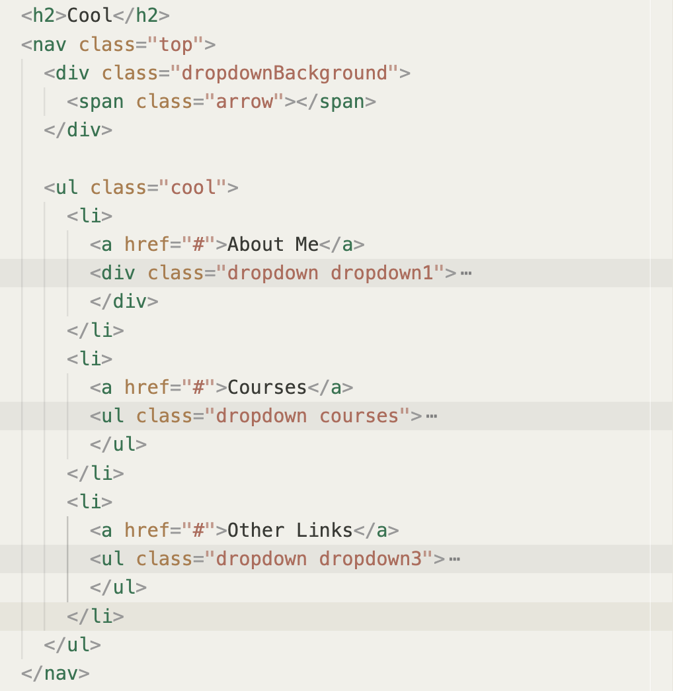

# Stripe Follow Along Dropdown Navigation

[JavaScript30 26/30](https://www.youtube.com/watch?v=GvuWJSXYQDU&list=PLu8EoSxDXHP6CGK4YVJhL_VWetA865GOH&index=26&ab_channel=WesBos)
模拟[Stripe](https://stripe.com/en-jp)导航条效果：

- 鼠标在标签上悬停时自动显示下拉栏
- 不同标签之间流畅切换
- 背景尺寸适应内容
- 原网站在滑入滑出时还有个卡片向前翻向后翻的动画效果，此处没有复现

## Parsing start file

```html
<div class="dropdownBackground">
  <span class="arrow"></span>
</div>
```

所有标签的下拉菜单的背景是同一个 div，根据内容改变它大小，而不是每个下拉菜单各有单独的背景。
class 为 arrow 的 span 元素是 tab 与下拉菜单之间的箭头。

整个 HTML 结构为：

应该在 li 元素上监听 hover 事件，因为如果在 a 元素上监听，那悬停在下拉栏里面时，事件相当于没有触发，下拉栏会收起，这不是我们想要的效果。

CSS 需要注意的是 li 元素的`postion: relative;`

## 思路与步骤

### Step1 获取页面元素并建立事件框架

实现目标效果只涉及两个事件，`mouseenter` 和 `mousemove`，根据上述分析，事件要在 li 元素上触发。获取页面元素并建立事件框架。

```js
const triggers = document.querySelectorAll(".cool>li");
const background = document.querySelector(".dropdownBackground");
const nav = document.querySelector("nav.top");

function handleMouseEnter() {}

function handleMouseLeave() {}

triggers.forEach((trigger) =>
  trigger.addEventListener("mouseenter", handleMouseEnter)
);
triggers.forEach((trigger) =>
  trigger.addEventListener("mouseleave", handleMouseLeave)
);
```

接下来分两步，第一步是悬停后显示下栏菜单内容（不包括背景），第二步是以适应内容的尺寸显示背景。

## Step2 显示下拉菜单内容

即鼠标悬停在 tab 上时显示对应 li 下 class 为 dropdown 的元素，这些元素默认 css 为`display:none`，所以不显示。

CSS 中写了两个 class 控制是否显示下拉菜单。

```css
.dropdown {
  opacity: 0;
  display: none;
  transition: all 0.5s;
}
.trigger-enter .dropdown {
  display: block;
}
.trigger-enter-active .dropdown {
  opacity: 1;
}
```

只要定位到具体的.dropdown 元素，为其添加或删除这两个 class ，CSS 会根据类的有无决定某个下拉栏是否显示。

之所以分成两个 class，是因为我们希望悬停后 display 由 none 变为 block，透明度由 0 到 1 的过程都有个 transition，如果将二者放到一个 css rule 里，透明度的改变没有过渡，下拉栏不再隐藏时透明度会立刻直接变成 1。解决方式就是分两步，第一步 display 由 none 变为 block，数秒后透明度由 0 到 1 。而隐藏时不需要分两步。

```js
function handleMouseEnter() {
  this.classList.add("trigger-enter");
  setTimeout(() => this.classList.add("trigger-enter-active"), 150);
}

function handleMouseLeave() {
  this.classList.remove("trigger-enter", "trigger-enter-active");
}
```

老师说 React 等框架的 transition 实际上也是这样分两步应用了两个独立的 class 分别控制 display 和 opacity。

（其实完全可以不设 display 单纯用 opacity 控制是否显现啊，经试验确实可以）

## Step3 显示下拉栏的白色背景

CSS 中亦写了控制白色背景显现与否的类`open`

```css
.dropdownBackground {
  opacity: 0;
}
.dropdownBackground.open {
  opacity: 1;
}
```

为了在鼠标滑入时正确显示白色背景，在 handleMouseEnter 中继续写以下内容：
先使鼠标滑入滑出时显示或隐藏白色背景 - 在对应事件添加或移除类。

```js
// 在 handleMouseEnter 中
background.classList.add("open");
// 在 handleMouseLeave 中
background.classList.remove("open");
```

然后我们需要知道展开的下拉栏的宽度和高度，据此调整白色背景大小，并将其位置移至下拉栏背后。
[元素的 getBoundingClientRect()方法](https://developer.mozilla.org/zh-CN/docs/Web/API/Element/getBoundingClientRect)提供了元素的大小及其相对于视口的位置。
将背景的大小及相对于视口的位置设为与下拉栏相同。

由于元素的 top 和 left 设置的是其相对于包含块的位置（position 为 absolute 的元素，其包含块是最近的 position 不为 static 的上层元素），因此若要设置其相对于视口的位置与下拉栏一致，其 top 和 left 就要减去包含块相对于视口的位置。

```js
// 在 handleMouseEnter 中
const dropdown = this.querySelector(".dropdown");
const dropdownCoords = dropdown.getBoundingClientRect();
// 之所以每次都重新获取是因为nav的位置也可能改变（例如打开和关闭banner时）
const navCoords = nav.getBoundingClientRect();
console.log(navCoords.top);
const coords = {
  height: dropdownCoords.height,
  width: dropdownCoords.width,
  top: dropdownCoords.top - navCoords.top,
  left: dropdownCoords.left - navCoords.left,
};
background.style.setProperty("width", `${coords.width}px`);
background.style.setProperty("height", `${coords.height}px`);
background.style.setProperty("top", `${coords.top}px`);
background.style.setProperty("left", `${coords.left}px`);
```

## Step4 处理 edge cases

在分两步让下拉栏显现时，先添加 class `trigger-enter`, 150ms 后添加 class `trigger-enter-active` ，但如果 150ms 内已经把鼠标移出了，仍会添加`trigger-enter-active`类，这时候这个类是多余的，所以可以在这一步加个检查条件，通过`trigger-enter`类的有无判断鼠标是否还在当前 li 元素内。

```js
setTimeout(
  () =>
    this.classList.contains("trigger-enter") &&
    this.classList.add("trigger-enter-active"),
  150
);
```
